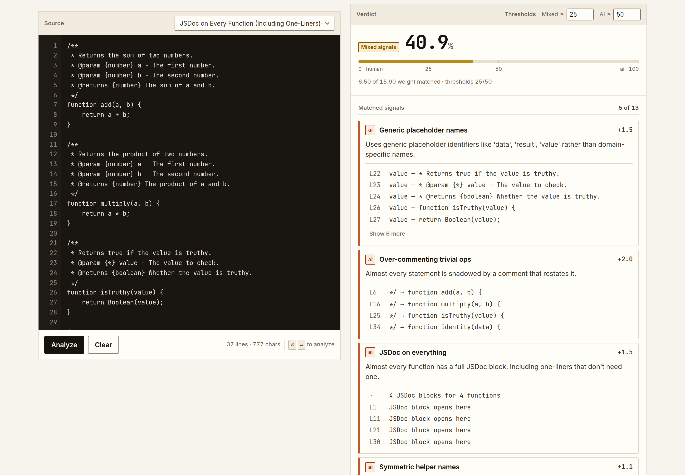
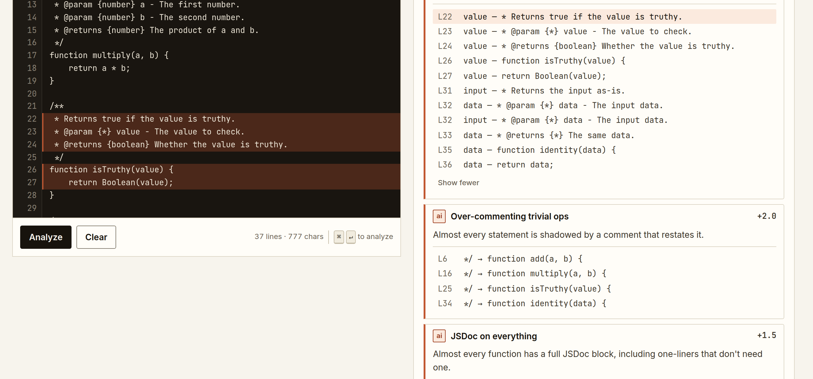
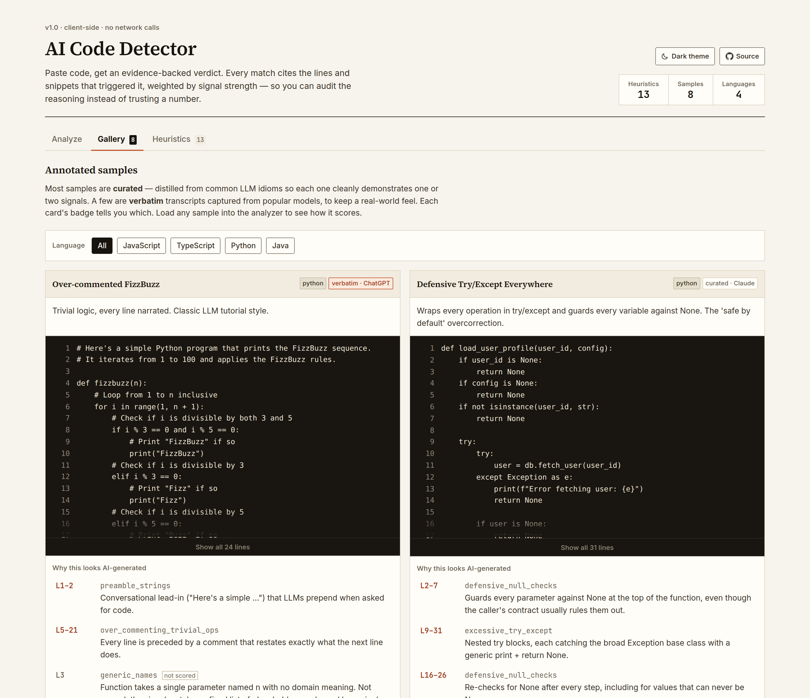
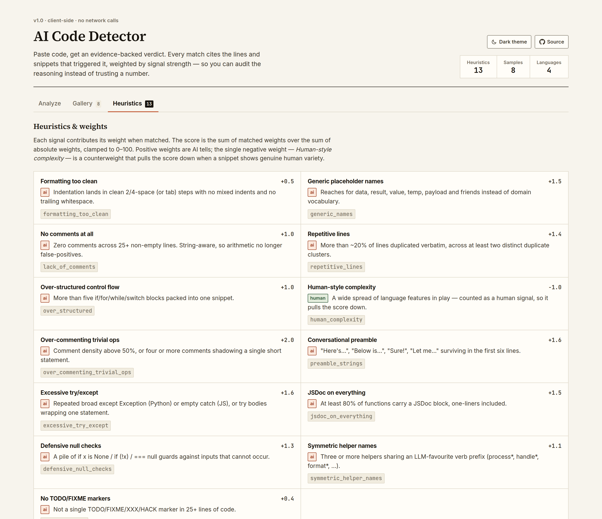
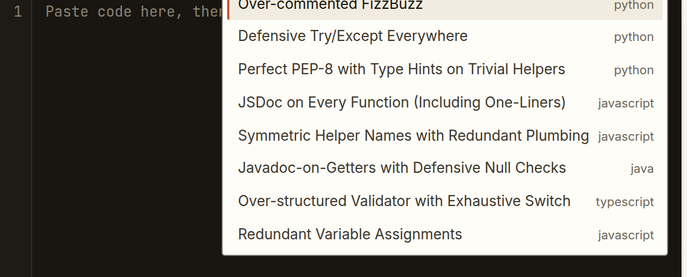
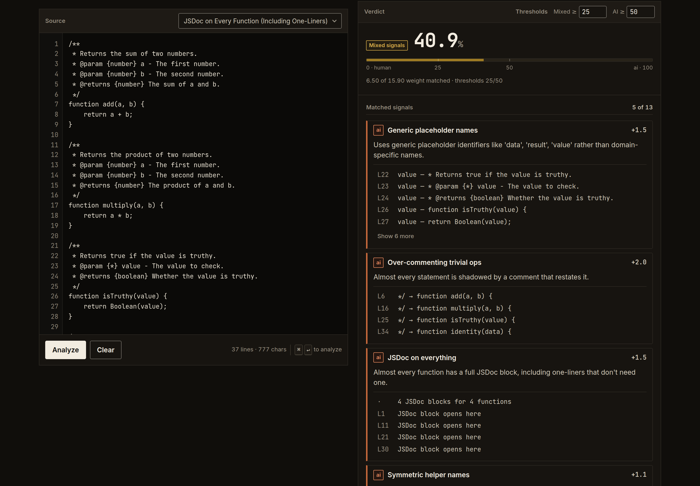
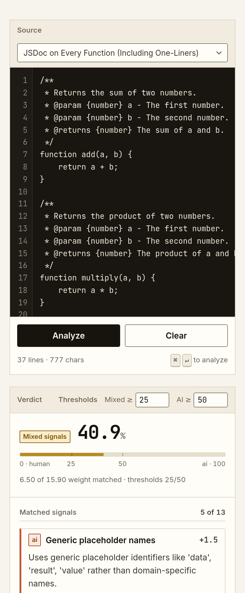

# AI Code Detector

[](https://github.com/Gabriel-Dalton/AI-Code-Detector/actions/workflows/ci.yml)
[](https://github.com/Gabriel-Dalton/AI-Code-Detector/releases)
[](LICENSE)
[](package.json)

A single-page tool that analyses a snippet of code, estimates the likelihood an
LLM wrote it, and — the part that matters — **shows the evidence behind every
finding**: which heuristic fired, what its weight was, the matching line
numbers, and the exact snippets that triggered it.

Everything runs locally in the browser. No network calls, no telemetry, no model
API behind the curtain. The goal is to teach you to spot the tells yourself, not
to outsource the judgement to another LLM.



## Contents

- [What it does](#what-it-does) · [How the score works](#how-the-score-works) ·
  [The heuristics](#the-heuristics)
- [Known limitations](#known-limitations) — read this before trusting a number
- [Getting started](#getting-started) · [Project layout](#project-layout) ·
  [Development](#development)
- [Design notes](#design-notes) · [Accessibility](#accessibility) ·
  [Roadmap](#roadmap) · [Contributing](#contributing)

## What it does

**Findings cite their lines, and hovering one lights those lines in the editor.**
Click an evidence row to jump the editor selection straight to it.



**Eight annotated samples** across JavaScript, TypeScript, Python and Java. Each
card shows the code, a list of annotations explaining which signal is present
and *why* it's a tell, and a button to load it into the analyzer.



Annotations describe tells a reader should learn to see, which is a wider set
than the tells this tool scores. Where the two diverge the annotation is marked
`not scored` and says why — usually that the signal is gated on a snippet length
the sample doesn't reach. A test asserts every *unmarked* annotation against the
live engine, so the teaching material can't quietly drift from the code.

**Every heuristic is documented in-app**, with its weight, its tone (AI, human,
or counterweight) and a line on what it looks for. The tab renders straight from
the `HEURISTICS` array, so there's one source of truth rather than two.



**A custom example picker**, because a native `<select>` paints its open list
with OS chrome that ignores the palette entirely. This implements the ARIA
combobox/listbox pattern, keeping the full keyboard contract — arrows, Home/End,
Enter, Escape, type-ahead.



**Light and dark, both first-class.** Follows the system preference; the toggle
in the masthead pins an explicit choice and remembers it.



**Works down to a phone.** The workbench stacks, the tab strip scrolls, the stat
strip spreads to full width, and the editor keeps its line numbers.



## How the score works

Each heuristic returns whether it matched, its weight, and evidence — the exact
line numbers and snippets that triggered it.

```
score = Σ (matched weights) / Σ |all weights|     clamped to [0, 100]
```

The denominator uses absolute values, so the one negative weight
(*Human-style complexity*) can pull the score down without shrinking the scale.
A verdict label is attached from two thresholds you can tune next to the
**Analyze** button:

| Score | Verdict |
| --- | --- |
| `≥ 50` (default) | Likely AI-generated |
| `≥ 25` (default) | Mixed signals |
| below that | Likely human-written |

### The heuristics

These descriptions live on the `about` field of each entry in the `HEURISTICS`
array in `detector.js`, which is also what the in-app **Heuristics** tab renders.

| Signal | Weight | What it looks for |
|---|---:|---|
| Formatting too clean | +0.5 | Indentation lands in clean 2/4-space (or tab) steps with no mixed indents and no trailing whitespace. |
| Generic placeholder names | +1.5 | Reaches for `data`, `result`, `value`, `temp`, `payload` and friends instead of domain vocabulary. |
| No comments at all | +1.0 | Zero comments across 25+ non-empty lines. String-aware, so a `//` inside a URL doesn't count. |
| Repetitive lines | +1.4 | More than ~20% of lines duplicated verbatim, across at least two distinct duplicate clusters. |
| Over-structured control flow | +1.0 | More than five `if`/`for`/`while`/`switch` blocks packed into one snippet. |
| Human-style complexity | −1.0 | A wide spread of language features in play — counted as a *human* signal, so it pulls the score down. |
| Over-commenting trivial ops | +2.0 | Comment density above 50%, or four or more comments shadowing a single short statement. |
| Conversational preamble | +1.6 | "Here's…", "Below is…", "Sure!", "Let me…" surviving in the first six lines. |
| Excessive try/except | +1.6 | Repeated broad `except Exception` (Python) or empty `catch` (JS), or `try` bodies wrapping one statement. |
| JSDoc on everything | +1.5 | At least 80% of functions carry a JSDoc block, one-liners included. |
| Defensive null checks | +1.3 | A pile of `if x is None` / `if (!x)` / `=== null` guards against inputs that cannot occur. |
| Symmetric helper names | +1.1 | Three or more helpers sharing an LLM-favourite verb prefix (`process*`, `handle*`, `format*`, …). |
| No TODO/FIXME markers | +0.4 | Not a single `TODO`/`FIXME`/`XXX`/`HACK` marker in 25+ lines of code. |

## Known limitations

Worth knowing before you read a number off the screen. Both of these are
measured, not hypothetical, and both are recorded here rather than papered over
because fixing them changes every verdict the tool produces.

**It is calibrated for snippets, not whole files.** Several signals are gated on
absolute counts — *Over-structured control flow* fires above five control-flow
blocks, *No comments at all* and *No TODO/FIXME markers* need 25+ non-empty
lines. Any real file clears those gates for reasons that have nothing to do with
who wrote it. Concretely: this repository's own hand-written `script.js` scores
**40.3%**, higher than six of the eight known-generated samples in its own
gallery. Paste functions, not files. Length-normalised thresholds are on the
roadmap.

**The default thresholds are conservative.** No sample in the gallery reaches
"Likely AI-generated" at the default 50% — the eight span 19.5% to 40.9%, and
they are all genuinely generated code. If you want the labels to track the
gallery, lower the AI threshold to around 35. The test suite pins the weaker
property that actually holds today (every generated sample outscores a
hand-written reference) rather than asserting a calibration that doesn't.

More generally: this is a panel of published heuristics, not a classifier with a
guarantee. Anyone can read the thirteen rules and write code that dodges them —
that's inherent to publishing them, which is the point. Use it to learn the
tells and to structure a conversation about a diff, not as evidence.

## Getting started

A modern browser. That's it — no build step, no toolchain.

```bash
git clone https://github.com/Gabriel-Dalton/AI-Code-Detector.git
cd AI-Code-Detector
open index.html          # or: npm run serve && open http://localhost:8899
```

Opening `index.html` straight off the filesystem works too — the fonts are
vendored locally, so nothing needs a server or an internet connection.

### Using it

1. Paste code into the editor, or pick a sample from **Load an example**.
2. Press **Analyze** (or <kbd>⌘</kbd>/<kbd>Ctrl</kbd> + <kbd>Enter</kbd>).
3. Read the verdict, then work down the matched findings for the line-numbered
   evidence behind each one.
4. Hover a finding to spotlight its lines; click an evidence row to jump there.

Your last input, the two thresholds and your theme choice persist in
`localStorage` so a refresh doesn't lose your place.

## Project layout

```
index.html              markup, meta tags, the pre-paint theme script
style.css               design tokens + every component
detector.js             the engine: heuristics, evidence, scoring — no DOM
script.js               the UI: rendering, gallery, tabs, combobox, editor
examples.js             the annotated sample gallery, as data
test/                   Node tests over detector.js, examples.js and the docs
scripts/                dev tooling: contrast audit, screenshot generator
assets/fonts/           vendored woff2 subsets + OFL licence
docs/images/            README figures, generated by scripts/screenshots.mjs
```

The three script tags at the bottom of `index.html` are the entire build system.
`package.json` exists only to pin dev tooling; the app has no runtime
dependencies.

The split between `detector.js` and `script.js` is the one structural rule worth
protecting. The engine is pure — string in, findings out, no DOM, no storage, no
network — which is exactly what makes it testable under Node with no browser and
no bundler. In the browser both are plain scripts and every symbol is a global,
so nothing about the split costs the project its no-build-step property.

## Development

```bash
npm test                 # the whole suite — no dependencies, no browser
```

`npm test` runs on Node's built-in test runner and needs nothing installed, so it
works on a fresh clone before `npm install` finishes. CI runs it on Node 20, 22
and 24; if it ever needs a dependency, that's a regression.

What it covers, roughly 190 assertions:

- **Every heuristic, twice** — once against a snippet it must flag, once against
  a snippet it must leave alone. The second half is the one that matters: a
  detector that fires on everything has perfect recall and no value, so each
  signal's `quiet` fixture sits just the other side of its threshold. A
  registered heuristic with no fixture pair fails the build.
- **The scoring arithmetic** — the denominator, the counterweight, the floor at
  zero, the inclusive band edges, and that every normalised threshold pair leaves
  the verdict bands reachable.
- **The gallery, against the live engine** — every sample's `expectedSignals`
  must actually fire, every annotation must cite a line that exists, and every
  unmarked annotation must correspond to a real match.
- **Degenerate input** — empty strings, lone surrogates, unterminated literals,
  CRLF, a 20 000-character line.
- **The repository itself** — version consistency across `package.json`, the
  masthead and the changelog; every relative link in the docs resolving; no
  screenshot orphaned or missing; no third-party origin in the markup.

The two Playwright-driven scripts need one install:

```bash
npm install
npm run serve &
npm run audit:contrast   # WCAG 2.1 AA, both themes, six interaction states
npm run screenshots      # regenerate every README figure
```

Neither pins a browser revision hard — `scripts/browser.mjs` will use
Playwright's own Chromium, fall back to any it can find, or take `CHROMIUM_PATH`.

## Design notes

The UI is deliberately **not** a gradient/glassmorphic/pill-button SaaS landing
page. An AI-detector whose own UI looks AI-generated would be a self-defeating
pitch — the heuristics here literally flag "formatting too clean" and
"over-uniform indentation" as tells. The design borrows from engineering and
editorial references instead.

### Typography: three faces, one job each

| Face | Used for |
| --- | --- |
| **Source Serif 4** | Titles — the page, a section, a sample. The editorial voice. |
| **Inter** | Interface labels and prose. |
| **JetBrains Mono** | Code and figures, and nothing else. |

That last rule is load-bearing. Wide-tracked uppercase monospace applied to
*every* label — eyebrows, panel titles, badges, footers — is itself a visual
cliché of machine-generated design, and an earlier revision of this UI was
covered in it. Now monospace means "this is literally code or a measurement", so
it carries information rather than texture. Numbers inside prose use the sans
with tabular figures instead.

The fonts are **vendored under `assets/fonts/`** (latin + latin-ext woff2
subsets, ~220 KB, SIL OFL 1.1). That's a correctness fix, not just a performance
one: the masthead claims "no network calls", and loading webfonts from a
third-party CDN would have made that claim false. A test asserts the markup
contains no third-party origin, so it stays true.

### Everything else

- **Paper ground, ruled borders.** Warm off-white surface, 1px separators in a
  slightly darker ink. No floating cards, no soft drop shadows, no glass.
- **Restrained palette.** Ink, paper, one terracotta for AI signals, one deep
  green for human signals, one ochre for the mixed band. No decorative colour.
  Every value is declared once with `light-dark()`, so the light and dark
  palettes sit on adjacent lines and can't drift apart.
- **Tabs as text with a 2px underline**, not frosted pills. Wired with
  `role="tab"`/`aria-controls` and arrow-key navigation.
- **Two-column workbench** on wide screens: source left, verdict right. The
  editor column is sticky, because the evidence column is almost always taller
  and you want the code to stay put while you read down the findings.
- **Bounded output.** Findings show five evidence rows behind a "show N more",
  and unmatched signals collapse into one drawer. An uncapped dump of every
  match was the single biggest thing making the results panel look unconsidered.
- **No emoji in the chrome.** They drift toward decorative noise and read as a
  "vibe-coded" tell.

## Accessibility

Keyboard-reachable throughout, with a visible focus ring on every control, a
skip link to the editor, `aria-live` announcement of each verdict, and
`prefers-reduced-motion` honoured. <kbd>Tab</kbd> inside the editor inserts an
indent but <kbd>Shift</kbd>+<kbd>Tab</kbd> still moves focus, so the textarea
never becomes a keyboard trap.

**Contrast is verified, not assumed.** `scripts/contrast-audit.mjs` renders the
real page in both themes across six interaction states and checks every
foreground/background pair against WCAG 2.1 AA. It reads computed styles rather
than the token table, because `light-dark()`, alpha compositing and tinted hover
states all mean a declared value tells you very little about what actually lands
on screen. It covers 1.4.3 (text, 4.5:1 or 3:1 when large), 1.4.11 (control
boundaries and the focus indicator, 3:1) and 2.4.7 (a visible keyboard focus
indicator), and exits non-zero on any failure so it gates CI.

Two token decisions fell out of running it:

- The text ramp stops at three tiers. A fourth, fainter grey could not clear
  4.5:1 without becoming indistinguishable from the third, so quiet text is
  differentiated by size, weight and italics instead of by more greys.
- Control boundaries get their own token (`--control-border`, 3.2:1) rather than
  sharing the decorative `--rule-2`. For a text input the border *is* the
  information that says "you can act here", so it has to clear 1.4.11 — while a
  decorative separator carries no information and can stay delicate.

The audit's own checks are mutation-tested: sabotaging the focus colour, a text
token, or the control border each produce the expected failures, so a green run
means something.

## Roadmap

Roughly ordered from "useful and small" to "useful and bigger".

### Next

- [ ] **Length-normalised thresholds**, so the count-gated signals stop reading
      any large file as generated. This is the top item — see
      [Known limitations](#known-limitations).
- [ ] **Recalibrate the default AI threshold** against the gallery, or publish
      the reasoning for keeping it at 50.
- [ ] **Deploy it.** No build step and no backend, so this is a static deploy:
      import the repo at [vercel.com/new](https://vercel.com/new), framework
      preset *Other*, empty build command, output directory the repo root.
      Worth doing alongside: a `vercel.json` pinning long-lived `Cache-Control`
      on `assets/fonts/*` plus the security headers Vercel doesn't set by
      default; an absolute `og:image`, which needs a real domain to point at;
      and a custom domain so the URL is quotable. GitHub Pages also works;
      Vercel wins on preview deploys per PR.
- [ ] Per-signal weight tuning in the UI (a slider per heuristic, persisted to
      `localStorage`, exportable as JSON).
- [ ] Copy/share-verdict button producing a Markdown summary for a PR review.
- [ ] Expand the gallery to Go, Rust and C#.
- [ ] Bring-your-own samples: an authoring flow that stores an annotated entry
      in `localStorage` and exports the JSON for a PR.

### Eventually

- [ ] Multi-file analysis (drag in a folder; per-file verdicts plus aggregate).
- [ ] Diff mode: paste two snippets, see the *change* in signal profile — useful
      for "this PR was probably AI-completed" reviews.
- [ ] Language-aware heuristics: a real tokenizer for JS/TS/Python so we can
      stop sniffing with regex.
- [ ] Calibration page: paste a labelled corpus, see ROC/precision/recall across
      the threshold range, export the curve.
- [ ] Permalink-encoded snippets (`?code=…&thresholds=…`) so a verdict can be
      shared without a server.

### Done

- [x] Configurable verdict thresholds in the UI.
- [x] <kbd>⌘</kbd>/<kbd>Ctrl</kbd>+<kbd>Enter</kbd> to analyze; `localStorage`
      persistence of input and thresholds.
- [x] Hover-to-locate: hovering an evidence row highlights the cited lines.
- [x] Dark theme on the same palette inverted, following the system preference
      with an explicit override.
- [x] A test suite, and CI running it alongside the contrast audit.

### Out of scope, on purpose

- **A model-based classifier.** The whole point is to teach the reader to
  recognise the tells; replacing the heuristics with a black box defeats it.
- **A backend.** Static HTML + JS keeps the deploy story trivial and the privacy
  story honest.

## Contributing

Contributions are welcome — see [CONTRIBUTING.md](CONTRIBUTING.md) for the
layout, what adding a heuristic or a gallery sample involves, and the two design
rules that keep the UI coherent.

The fastest way in: find a heuristic in `detector.js` that misfires on code you
actually wrote, and open an issue with the snippet. False positives are the most
useful report this project can get.

- [Code of Conduct](CODE_OF_CONDUCT.md)
- [Security policy](SECURITY.md)
- [Changelog](CHANGELOG.md)

## License

[MIT](LICENSE) for the code.

The bundled webfonts under `assets/fonts/` are third-party and stay under their
own licence — Source Serif 4, Inter and JetBrains Mono are all SIL Open Font
License 1.1, reproduced in
[`assets/fonts/LICENSE-OFL.txt`](assets/fonts/LICENSE-OFL.txt).
