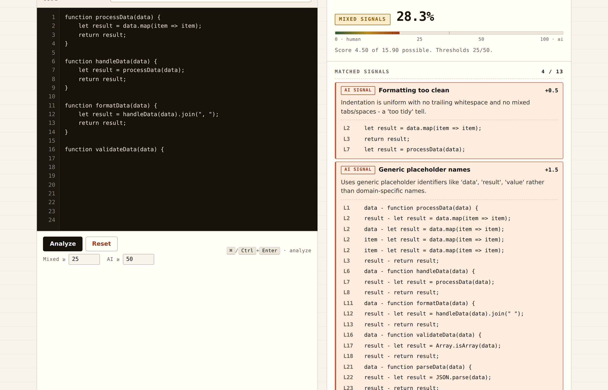

# AI Code Detector

The **AI Code Detector** is a single-page web tool that analyses a snippet of
code, estimates the likelihood it was written by an LLM, and — most
importantly — **shows the evidence behind every finding**: which heuristic
fired, what its weight was, the matching line numbers, and the exact
snippets that triggered it. An in-app gallery of annotated samples lets you
see common AI tells side-by-side with explanations of *why* they're
suspicious.

Everything runs locally in the browser. No network calls. No telemetry. No
model API behind the curtain — the goal is to teach the reader to spot the
tells themselves, not to outsource judgement to another LLM.


## Highlights

| | |
| --- | --- |
|  | **Line-numbered editor with hover-to-locate evidence.** Load an example or paste your own; every matched signal lists the line numbers and snippets that triggered it. |
|  | **Hover any finding → those lines light up in the editor.** Click an evidence row to jump the textarea selection straight to that line. |
|  | **Curated gallery of annotated AI samples** across JavaScript, TypeScript, Python and Java — each card tells you which signal is present, on which lines, and why it's a tell. |
|  | **Every heuristic is documented in-app**, with its weight, its tone (AI / human / counterweight) and a one-line description of what it looks for. |

## How it works

The detector evaluates the pasted code against a panel of weighted
heuristics. Each heuristic returns:

- **whether it matched**,
- **its weight** (its contribution to the score), and
- **evidence** — the exact line numbers and snippets that triggered the match.

The verdict score is `(Σ matched weights) / (Σ |weights|)`, clamped to
`[0, 100]`. A verdict label (`Likely AI-generated`, `Mixed signals`,
`Likely human-written`) is attached based on two thresholds you can tune
right next to the **Analyze** button (defaults: `25` / `50`).

### Heuristics

| Signal                          | Weight | What it looks for |
|---------------------------------|-------:|-------------------|
| Formatting too clean            | +0.5   | Indentation in clean 2/4-space (or tab) steps with no mixed indents and no trailing whitespace. |
| Generic placeholder names       | +1.5   | Use of `data`, `result`, `value`, `temp`, `payload`, etc. in place of domain names. |
| No comments at all              | +1.0   | Zero comments across 25+ non-empty lines (string-aware, so `a * b` no longer false-positives). |
| Repetitive lines                | +1.4   | More than ~20% of lines duplicated verbatim, with at least two distinct duplicate clusters. |
| Over-structured control flow    | +1.0   | More than 5 `if/for/while/switch` blocks packed into the snippet. |
| Human-style complexity          | -1.0   | Wide variety of language features in use — counted as a *human* signal. |
| Over-commenting trivial ops     | +2.0   | Comment density > 50%, or a comment shadowing a single short statement four or more times. |
| Conversational preamble         | +1.6   | "Here's…", "Below is…", "Sure!", "Let me…" in the first six lines. |
| Excessive try/except            | +1.6   | Multiple bare/broad `except Exception` (Python) or empty `catch` (JS), or single-statement try bodies. |
| JSDoc on everything             | +1.5   | At least 80% of functions have a JSDoc block, including one-liners that don't need one. |
| Defensive null checks           | +1.3   | Many `if x is None`, `if (!x)`, or `=== null` guards against impossible inputs. |
| Symmetric helper names          | +1.1   | A cluster of three or more helpers sharing an LLM-favourite verb prefix (`process*`, `handle*`, `format*`, …). |
| No TODO/FIXME markers           | +0.4   | Zero `TODO/FIXME/XXX/HACK` markers in 25+ lines of code. |

### Evidence-backed findings

Every match is accompanied by line numbers and snippets so you can see
exactly *why* a signal fired. Hover a finding to highlight the cited lines
in the editor; click an evidence row to jump the textarea selection to that
line.

## Examples gallery

The app ships with eight annotated AI-generated samples covering
JavaScript, TypeScript, Python and Java. Each card shows:

- the code with line numbers,
- a list of annotations describing **which signal** is present and **why
  it's a tell**, and
- a button to load the example into the analyzer so you can see how the
  detector scores it.

Most samples are **curated** — distilled from common LLM idioms so each one
cleanly demonstrates one or two signals. A few are **verbatim** captures
from popular LLMs to give a real-world feel; these carry a `verbatim` badge
with a `sourceLabel` (ChatGPT / Claude / Copilot / Gemini) indicating which
model produced the canonical output. Curating most of the gallery sidesteps
licensing questions and keeps each card focused on a single teaching point
rather than the muddier mix of signals you typically get in a raw
transcript.

## Getting started

### Prerequisites

A modern browser. That's it. No build step, no toolchain.

### Run it

```bash
git clone https://github.com/Gabriel-Dalton/AI-Code-Detector.git
cd AI-Code-Detector
# Either: open index.html directly in your browser
# Or: serve the directory (any static server works)
npx http-server -p 8888
# then visit http://localhost:8888
```

### Use it

1. Paste code into the editor on the left.
2. Press **Analyze** (or `⌘`/`Ctrl` + `Enter`).
3. Read the verdict bar, then expand any matched finding to see the
   line-numbered evidence.
4. Hover a finding to spotlight its lines in the editor.

The textarea, mixed/AI thresholds and your last input are persisted in
`localStorage` so a refresh doesn't lose your place.

## Design notes

The UI is deliberately **not** a gradient/glassmorphic/pill-button SaaS
landing page. An AI-detector whose own UI looks AI-generated would be a
self-defeating pitch — the heuristics in this project literally flag
"formatting too clean", "no rough edges", "over-uniform indentation" as
tells. The design borrows from engineering and editorial references
instead:

- **Paper background, ruled borders.** Warm off-white surface, 1px
  separators in a slightly darker ink. No floating cards, no soft drop
  shadows, no glass.
- **Restrained palette.** Ink, paper, a single restrained terracotta
  accent for AI signals, a single deep green for human signals. No
  decorative colour.
- **Mono-forward typography.** Eyebrow labels, captions, weight badges,
  evidence snippets and IDs all use a monospace stack (JetBrains Mono /
  IBM Plex Mono / system mono). Body and headings are a tight, weighty
  sans.
- **Tabs as text with a 2px underline**, not pills with a frosted-glass
  background.
- **Two-column workbench** on wide screens: input on the left, verdict on
  the right. A single scroll, no modals.
- **No emoji in the chrome.** They drift toward decorative noise and they
  read as a "vibe-coded" tell. The detector takes itself a little more
  seriously now.

## Roadmap

Tracked here so contributors can pick things up. Items are roughly ordered
from "useful and small" to "useful and bigger".

### Soon

- [x] Configurable verdict thresholds in the UI (replaces the hard-coded
      35/65 gate).
- [x] `Cmd`/`Ctrl`+`Enter` shortcut to analyze; `localStorage`
      persistence of input + thresholds.
- [x] Hover-to-locate: hovering an evidence row highlights the cited
      lines in the editor.
- [ ] Per-signal weight tuning in the UI (slider per heuristic, persisted
      to `localStorage`, exportable as JSON).
- [ ] Copy/share-verdict button that produces a Markdown summary suitable
      for pasting into a PR review.
- [ ] Expand the gallery with more languages (Go, Rust, C#).
- [ ] Bring-your-own samples: a "paste a sample with annotations"
      authoring flow that stores the entry in `localStorage` and lets you
      export the JSON for a PR.

### Eventually

- [ ] Multi-file analysis (drag-and-drop a folder; analyse each file and
      show a per-file verdict + aggregate).
- [ ] Diff mode: paste two snippets, see the *change* in signal profile
      (useful for "this PR was probably AI-completed" reviews).
- [ ] Language-aware heuristics: a real tokenizer for JS/TS/Python so we
      can stop sniffing with regex (e.g. detect over-typing on trivial
      values in TS, detect Python type-hint over-annotation distinctly
      from JSDoc).
- [ ] Calibration page: paste a labelled corpus, see ROC/precision/recall
      across the threshold range, export the curve.
- [ ] Permalink-encoded snippets (`?code=…&thresholds=…`) so a verdict can
      be shared without a server.
- [ ] Optional dark theme using the same restrained palette inverted
      (paper → ink, accent intact).

### Out of scope (on purpose)

- A model-based classifier. The whole point is to teach the reader to
  recognise the tells; replacing the heuristics with a black-box model
  defeats the project.
- A backend. Static-served HTML + JS keeps the deploy story trivial and
  the privacy story honest.

## Contributing

Contributions are welcome. The fastest way in: open `index.html`, scroll
to a heuristic in `script.js` that you think misfires (or never fires),
and propose a fix with an annotated example added to `examples.js`. If you
add a heuristic, register it in the `HEURISTICS` array and the **Heuristics**
tab will pick it up automatically.

## License

MIT.
