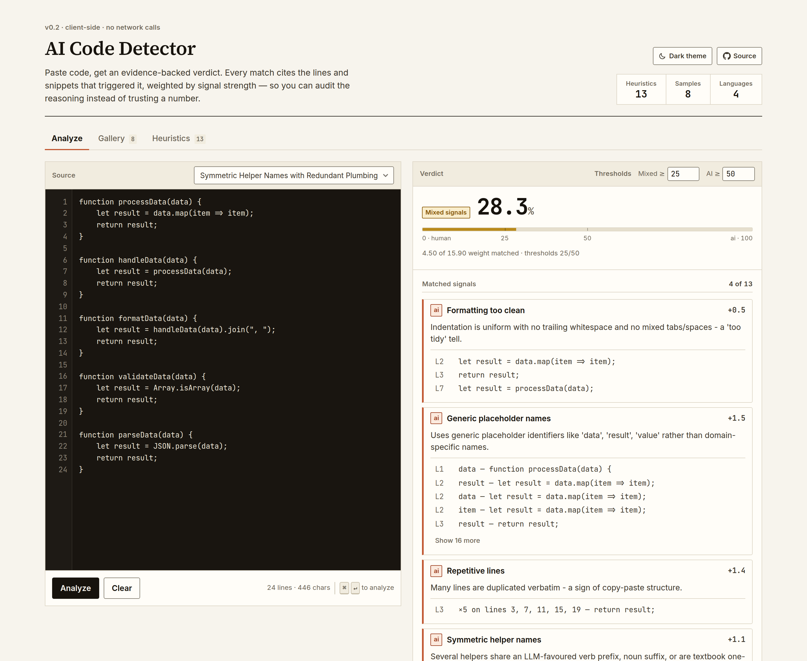
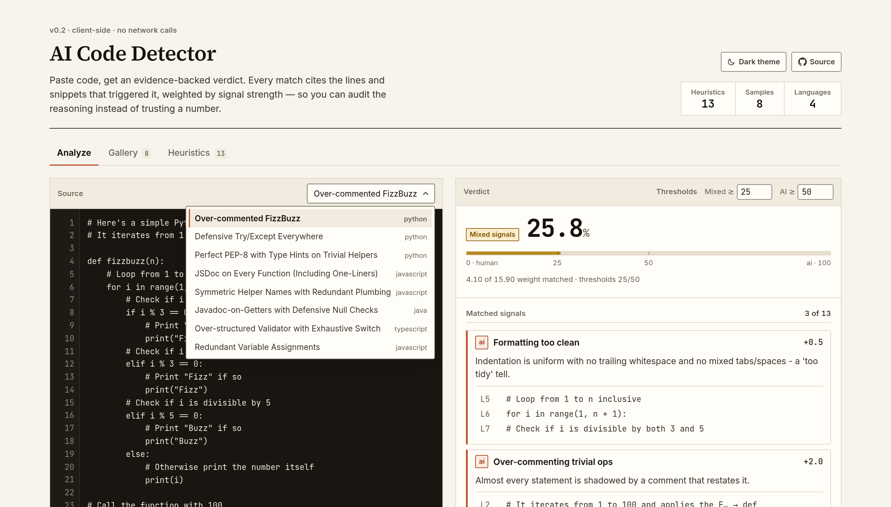
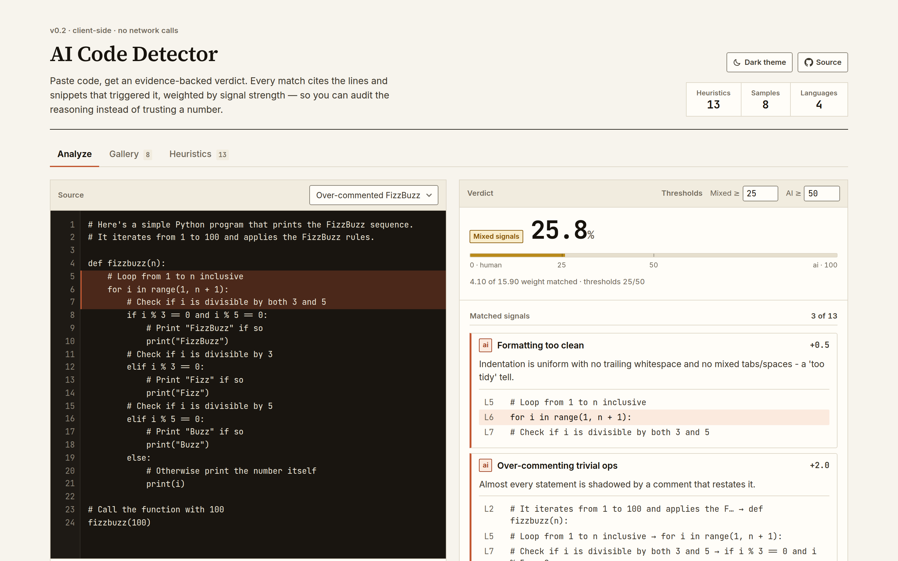
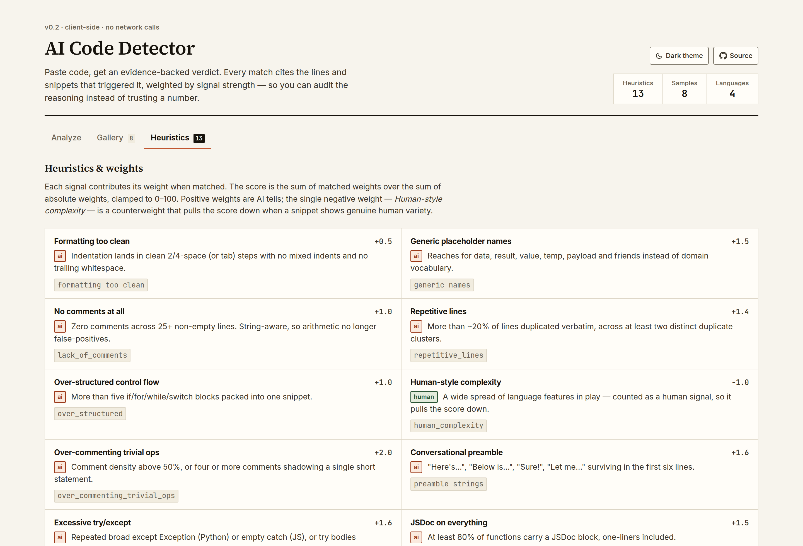
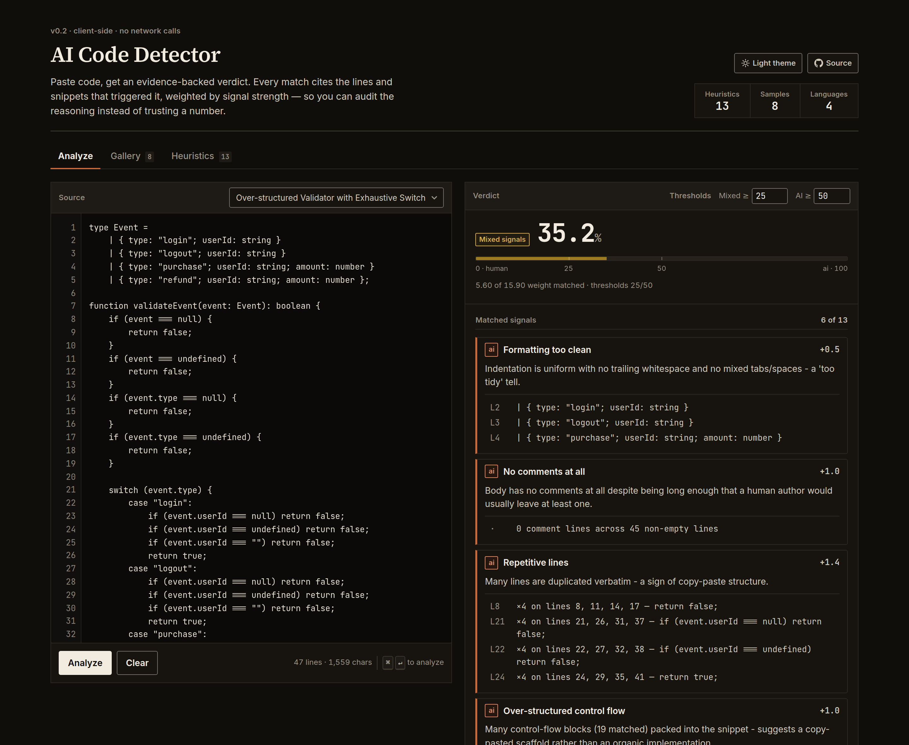
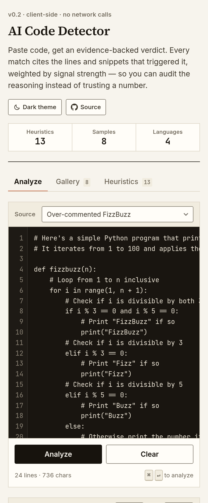

# AI Code Detector

The **AI Code Detector** is a single-page web tool that analyses a snippet of
code, estimates the likelihood it was written by an LLM, and — most
importantly — **shows the evidence behind every finding**: which heuristic
fired, what its weight was, the matching line numbers, and the exact
snippets that triggered it. An in-app gallery of annotated samples lets you
see common AI tells side-by-side with explanations of *why* they're
suspicious.

Everything runs locally in the browser. No network calls. No telemetry. No
model API behind the curtain — the goal is to teach the reader to spot the
tells themselves, not to outsource judgement to another LLM.



## Highlights

| | |
| --- | --- |
|  | **Line-numbered editor with hover-to-locate evidence.** Load an annotated sample from the dropdown or paste your own; every matched signal lists the line numbers and snippets that triggered it. |
|  | **Hover any finding → those lines light up in the editor.** Click an evidence row to jump the textarea selection straight to that line. |
|  | **Curated gallery of annotated AI samples** across JavaScript, TypeScript, Python and Java — each card tells you which signal is present, on which lines, and why it's a tell. |
|  | **Every heuristic is documented in-app**, with its weight, its tone (AI / human / counterweight) and a one-line description of what it looks for. |
|  | **Light and dark, both first-class.** Follows the system preference by default; the toggle in the masthead pins an explicit choice and remembers it. |
|  | **Works down to a phone.** The workbench stacks, the tab strip scrolls, the stat strip spreads to full width, and the editor keeps its line numbers. |

## How it works

The detector evaluates the pasted code against a panel of weighted
heuristics. Each heuristic returns:

- **whether it matched**,
- **its weight** (its contribution to the score), and
- **evidence** — the exact line numbers and snippets that triggered the match.

The verdict score is `(Σ matched weights) / (Σ |weights|)`, clamped to
`[0, 100]`. A verdict label (`Likely AI-generated`, `Mixed signals`,
`Likely human-written`) is attached based on two thresholds you can tune
right next to the **Analyze** button (defaults: `25` / `50`).

### Heuristics

These descriptions live on the `about` field of each entry in the
`HEURISTICS` array in `script.js`, which is also what the in-app
**Heuristics** tab renders — one source of truth rather than two.

| Signal                          | Weight | What it looks for |
|---------------------------------|-------:|-------------------|
| Formatting too clean            | +0.5   | Indentation lands in clean 2/4-space (or tab) steps with no mixed indents and no trailing whitespace. |
| Generic placeholder names       | +1.5   | Reaches for `data`, `result`, `value`, `temp`, `payload` and friends instead of domain vocabulary. |
| No comments at all              | +1.0   | Zero comments across 25+ non-empty lines. String-aware, so arithmetic no longer false-positives. |
| Repetitive lines                | +1.4   | More than ~20% of lines duplicated verbatim, across at least two distinct duplicate clusters. |
| Over-structured control flow    | +1.0   | More than five `if`/`for`/`while`/`switch` blocks packed into one snippet. |
| Human-style complexity          | −1.0   | A wide spread of language features in play — counted as a *human* signal, so it pulls the score down. |
| Over-commenting trivial ops     | +2.0   | Comment density above 50%, or four or more comments shadowing a single short statement. |
| Conversational preamble         | +1.6   | "Here's…", "Below is…", "Sure!", "Let me…" surviving in the first six lines. |
| Excessive try/except            | +1.6   | Repeated broad `except Exception` (Python) or empty `catch` (JS), or `try` bodies wrapping one statement. |
| JSDoc on everything             | +1.5   | At least 80% of functions carry a JSDoc block, one-liners included. |
| Defensive null checks           | +1.3   | A pile of `if x is None` / `if (!x)` / `=== null` guards against inputs that cannot occur. |
| Symmetric helper names          | +1.1   | Three or more helpers sharing an LLM-favourite verb prefix (`process*`, `handle*`, `format*`, …). |
| No TODO/FIXME markers           | +0.4   | Not a single `TODO`/`FIXME`/`XXX`/`HACK` marker in 25+ lines of code. |

### Evidence-backed findings

Every match is accompanied by line numbers and snippets so you can see
exactly *why* a signal fired. Hover a finding to highlight the cited lines
in the editor; click an evidence row to jump the textarea selection to that
line.

## Examples gallery

The app ships with eight annotated AI-generated samples covering
JavaScript, TypeScript, Python and Java. Each card shows:

- the code with line numbers,
- a list of annotations describing **which signal** is present and **why
  it's a tell**, and
- a button to load the example into the analyzer so you can see how the
  detector scores it.

Most samples are **curated** — distilled from common LLM idioms so each one
cleanly demonstrates one or two signals. A few are **verbatim** captures
from popular LLMs to give a real-world feel; these carry a `verbatim` badge
with a `sourceLabel` (ChatGPT / Claude / Copilot / Gemini) indicating which
model produced the canonical output. Curating most of the gallery sidesteps
licensing questions and keeps each card focused on a single teaching point
rather than the muddier mix of signals you typically get in a raw
transcript.

## Getting started

### Prerequisites

A modern browser. That's it. No build step, no toolchain.

### Run it

```bash
git clone https://github.com/Gabriel-Dalton/AI-Code-Detector.git
cd AI-Code-Detector
# Either: open index.html directly in your browser
# Or: serve the directory (any static server works)
npx http-server -p 8888
# then visit http://localhost:8888
```

Opening `index.html` straight off the filesystem works too — the fonts are
vendored locally, so nothing needs a server or an internet connection.

### Use it

1. Paste code into the editor on the left, or pick a sample from the
   **Load an example** dropdown.
2. Press **Analyze** (or `⌘`/`Ctrl` + `Enter`).
3. Read the verdict, then work down the matched findings for the
   line-numbered evidence behind each one.
4. Hover a finding to spotlight its lines in the editor; click an evidence
   row to jump the cursor there.

Your last input, the mixed/AI thresholds and your theme choice are
persisted in `localStorage` so a refresh doesn't lose your place.

### Project layout

```
index.html              markup, meta tags, the pre-paint theme script
style.css               design tokens + every component
script.js               heuristics, scoring, rendering, the combobox
examples.js             the annotated sample gallery
assets/favicon.svg
assets/fonts/           vendored woff2 subsets + OFL licence
scripts/                dev tooling (the WCAG contrast audit)
docs/images/            README screenshots
```

`package.json` exists only to pin the dev tooling. The app has no runtime
dependencies and no build step — `index.html` is the whole entry point.

## Design notes

The UI is deliberately **not** a gradient/glassmorphic/pill-button SaaS
landing page. An AI-detector whose own UI looks AI-generated would be a
self-defeating pitch — the heuristics in this project literally flag
"formatting too clean", "no rough edges", "over-uniform indentation" as
tells. The design borrows from engineering and editorial references
instead.

### Typography: three faces, one job each

| Face | Used for |
| --- | --- |
| **Source Serif 4** | Titles — the page, a section, a sample. The editorial voice. |
| **Inter** | Interface labels and prose. |
| **JetBrains Mono** | Code and figures, and nothing else. |

That last rule is load-bearing. Wide-tracked uppercase monospace applied
to *every* label — eyebrows, panel titles, badges, footers — is itself a
visual cliché of machine-generated design, and an earlier revision of this
UI was covered in it. Now monospace means "this is literally code or a
measurement", so it carries information rather than texture. Numbers that
appear inside prose use the sans with tabular figures instead.

The fonts are **vendored under `assets/fonts/`** (latin + latin-ext woff2
subsets, ~220 KB, SIL OFL 1.1). That is a deliberate correctness fix, not
just a performance one: the masthead claims "no network calls", and loading
webfonts from a third-party CDN would have made that claim false.

### Everything else

- **Paper ground, ruled borders.** Warm off-white surface, 1px separators
  in a slightly darker ink. No floating cards, no soft drop shadows, no
  glass.
- **Restrained palette.** Ink, paper, one terracotta for AI signals, one
  deep green for human signals, one ochre for the mixed band. No
  decorative colour. Every value is declared once with `light-dark()`, so
  the light and dark palettes sit on adjacent lines and can't drift apart.
- **A custom dropdown, not a native `<select>`.** A native select paints
  its open list with OS chrome — a blue highlight bar that ignores the
  palette entirely. The example picker implements the ARIA
  combobox/listbox pattern instead, keeping the full keyboard contract
  (arrows, Home/End, Enter, Escape, type-ahead).
- **Tabs as text with a 2px underline**, not frosted pills. Wired with
  `role="tab"`/`aria-controls` and arrow-key navigation.
- **Two-column workbench** on wide screens: source on the left, verdict on
  the right. The editor column is sticky, because the evidence column is
  almost always the taller of the two and you want the code to stay put
  while you read down the findings.
- **Bounded output.** Findings show five evidence rows behind a "show N
  more", and unmatched signals collapse into one drawer. An uncapped dump
  of every match was the single biggest thing making the results panel
  look unconsidered.
- **No emoji in the chrome.** They drift toward decorative noise and read
  as a "vibe-coded" tell.

### Accessibility

Keyboard-reachable throughout, with a visible focus ring on every control,
a skip link to the editor, `aria-live` announcement of each verdict, and
`prefers-reduced-motion` honoured. `Tab` inside the editor inserts an
indent but `Shift`+`Tab` still moves focus, so the textarea never becomes a
keyboard trap.

**Contrast is verified, not assumed.** `scripts/contrast-audit.mjs` renders
the real page in both themes across six interaction states and checks every
foreground/background pair against WCAG 2.1 AA:

```bash
npm install            # dev-only; the app still has no build step
npm run serve &
npm run audit:contrast
```

It reads computed styles rather than the token table, because `light-dark()`,
alpha compositing and tinted hover states all mean a declared value tells
you very little about what actually lands on screen. It covers 1.4.3 (text,
4.5:1 or 3:1 when large), 1.4.11 (control boundaries and the focus
indicator, 3:1) and 2.4.7 (a visible keyboard focus indicator), and exits
non-zero on any failure so it can gate a commit.

Two token decisions fell out of running it:

- The text ramp stops at three tiers. A fourth, fainter grey could not clear
  4.5:1 without becoming indistinguishable from the third, so quiet text is
  differentiated by size, weight and italics instead of by more greys.
- Control boundaries get their own token (`--control-border`, 3.2:1) rather
  than sharing the decorative `--rule-2`. For a text input the border *is*
  the information that says "you can act here", so it has to clear 1.4.11 —
  while a decorative separator carries no information and can stay delicate.

The audit's own checks are mutation-tested: sabotaging the focus colour, a
text token, or the control border each produce the expected failures, so a
green run means something.

## Roadmap

Tracked here so contributors can pick things up. Items are roughly ordered
from "useful and small" to "useful and bigger".

### Soon

- [x] Configurable verdict thresholds in the UI (replaces the hard-coded
      35/65 gate).
- [x] `Cmd`/`Ctrl`+`Enter` shortcut to analyze; `localStorage`
      persistence of input + thresholds.
- [x] Hover-to-locate: hovering an evidence row highlights the cited
      lines in the editor.
- [x] Dark theme on the same palette inverted, following the system
      preference with an explicit override.
- [ ] **Deploy to Vercel.** No build step and no backend, so this is a
      static deploy: import the repo at
      [vercel.com/new](https://vercel.com/new), leave the framework preset
      as *Other*, leave the build command empty and the output directory as
      the repo root. Worth doing alongside it:
      - a `vercel.json` pinning long-lived `Cache-Control` on
        `assets/fonts/*` (they are content-addressed subsets and never
        change) plus the security headers Vercel doesn't set by default;
      - an absolute `og:image` — the meta tags are already in `index.html`,
        but a social preview image needs a real domain to point at, which
        is exactly what the deploy provides;
      - a custom domain, so the URL is quotable.
      GitHub Pages would also work; Vercel wins on preview deploys per PR.
- [ ] Per-signal weight tuning in the UI (slider per heuristic, persisted
      to `localStorage`, exportable as JSON).
- [ ] Copy/share-verdict button that produces a Markdown summary suitable
      for pasting into a PR review.
- [ ] Expand the gallery with more languages (Go, Rust, C#).
- [ ] Bring-your-own samples: a "paste a sample with annotations"
      authoring flow that stores the entry in `localStorage` and lets you
      export the JSON for a PR.

### Eventually

- [ ] Multi-file analysis (drag-and-drop a folder; analyse each file and
      show a per-file verdict + aggregate).
- [ ] Diff mode: paste two snippets, see the *change* in signal profile
      (useful for "this PR was probably AI-completed" reviews).
- [ ] Language-aware heuristics: a real tokenizer for JS/TS/Python so we
      can stop sniffing with regex (e.g. detect over-typing on trivial
      values in TS, detect Python type-hint over-annotation distinctly
      from JSDoc).
- [ ] Calibration page: paste a labelled corpus, see ROC/precision/recall
      across the threshold range, export the curve.
- [ ] Permalink-encoded snippets (`?code=…&thresholds=…`) so a verdict can
      be shared without a server.

### Out of scope (on purpose)

- A model-based classifier. The whole point is to teach the reader to
  recognise the tells; replacing the heuristics with a black-box model
  defeats the project.
- A backend. Static-served HTML + JS keeps the deploy story trivial and
  the privacy story honest.

## Contributing

Contributions are welcome. The fastest way in: open `index.html`, scroll
to a heuristic in `script.js` that you think misfires (or never fires),
and propose a fix with an annotated example added to `examples.js`.

Adding a heuristic means one entry in the `HEURISTICS` array — an `id`, a
`label`, a `weight`, an `about` line for the docs tab, and a `run` function
returning `{ matched, reason, evidence }`. The **Heuristics** tab, the
signal counts in the masthead and the scoring denominator all derive from
that array, so nothing else needs touching.

If you're changing the UI, two rules keep the design coherent:

- **Monospace is for code and figures only.** Labels, badges and headings
  belong to the sans (or the serif, for titles). See *Design notes* above
  for why.
- **Colours go through the tokens** at the top of `style.css`, declared
  once with `light-dark()`. Adding a raw hex value in a component rule
  means it will be wrong in one of the two themes — and run
  `npm run audit:contrast` before you push, since a new colour pairing is
  exactly what it exists to catch.

## License

MIT for the code.

The bundled webfonts under `assets/fonts/` are third-party and stay under
their own licence — Source Serif 4, Inter and JetBrains Mono are all SIL
Open Font License 1.1, reproduced in `assets/fonts/LICENSE-OFL.txt`.
